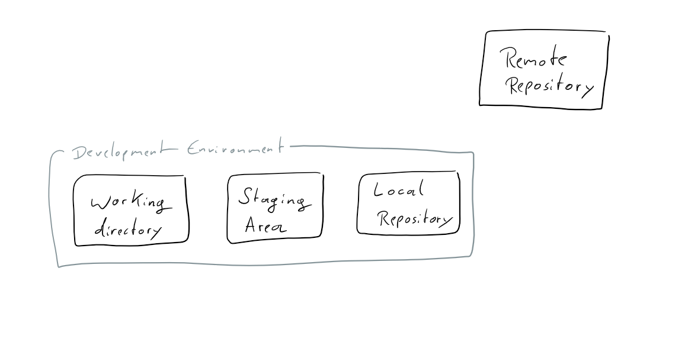
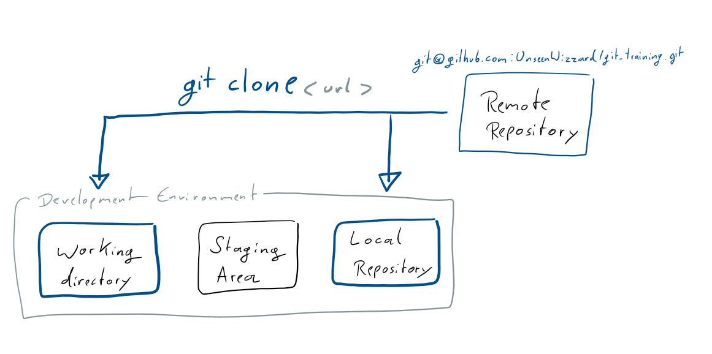
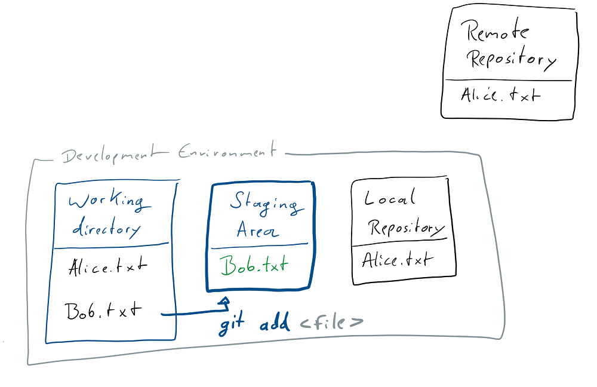
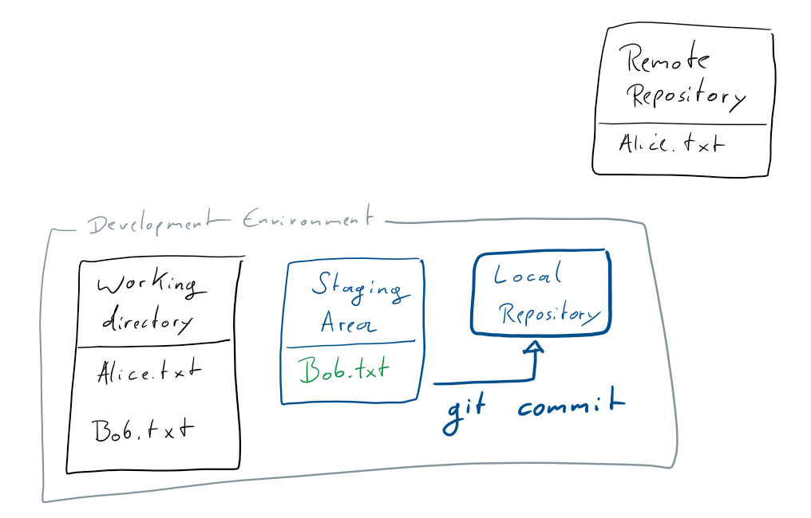
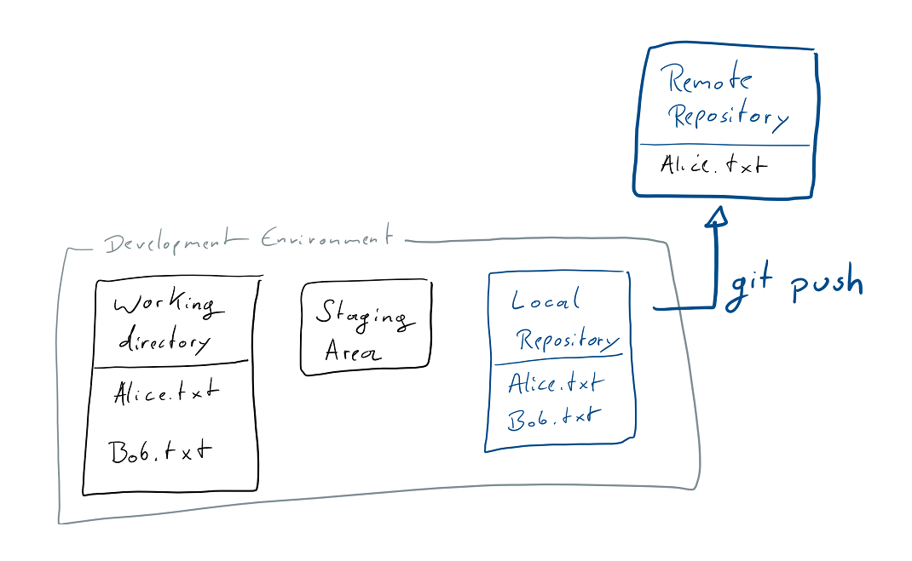

# git_training

---

An interactive git training meant to teach you how git works, not just which commands to execute.

Based on the general concept from Rachel M. Carmena's blog post on [How to teach Git](https://rachelcarmena.github.io/2018/12/12/how-to-teach-git.html) 

## This is currently a work in progres!

---

So, you want to use git right? 

But you don't just want to learn commands, you want to understand what you're using? 

Then this is meant for you!

Let's get started!

## Overview

In the picture below you see four boxes. One of them stands alone, while the other three are grouped together in what I'll call your _Development Environment_. 

We'll start with the one that's on it's own though. The _Remote Repository_ is where you send your changes when you want to share them with other people, and where you get their changes from. If you've used other version control systems there's nothing interesting about that. 

The _Development Environment_ is what you have on your local machine. 
The three parts of it are your _Working Directory_, the _Staging Area_ and the _Local Repository_. We'll learn more about those as we start using git. 

Choose a place in which you want to put your _Development Environment_. 
Just go to your home folder, or where ever you like to put your projects. You don't need to create a new folder for your _Dev Environment_ though. 

## Getting a _Remote Repository_ 

Now we want to grab a _Remote Repository_ and put what's in it onto your machine. 

I'd suggest we use this one ([https://github.com/UnseenWizzard/git_training.git](https://github.com/UnseenWizzard/git_training.git) if for some reason you're not already reading this on github).

> To to that I can use `git clone https://github.com/UnseenWizzard/git_training.git`
> 
> But as following this tutorial will need you get the changes you make in your _Dev Environment_ back to the _Remote Repository_, and github doesn't just allow anyone to do that to anyone's repo, you'll best create a _fork_ of it right now. There's a button to do that on the top right of this page. 

Now that you have a copy of my _Remote Repository_ of your own, it's time to get that onto your machine. 

For that we use `git clone https://github.com/{YOUR USERNAME}/git_training.git`

As you can see in the diagram below, this copies the _Remote Repository_ into two places, your _Working Directory_ and the _Local Repositry_. 
Now you see how git is _distributed_ version control. The _Local Repository_ is a copy of the _Remote_ one, and acts just like it. The only difference is that you don't share it with anyone. 

What `git clone` also does, is create a new folder whereever you called it. There should be a `git_training` folder now. Open it. 

## Adding new things

Someone already put a file into the _Remote Repository_. It's `Alice.txt`, and kind off lonely there. Let's create a new file and call it `Bob.txt`. 

What you've just done is add the file to your _Working Directory_. 
There's two kinds of files in your _Working Directory_: _tracked_ files that git knows about and _untracked_ files that git doesn't know about (yet). 

To see what's going on in your _Working Directory_ run `git status`, which will tell you what branch you're on, whether your _Local Repository_ is different from the _Remote_ and the state of _tracked_ and _untracked_ files. 

You'll see that `Bob.txt` is untracked, and `git status` even tells you how to change that. 
In the picture below you can see what happens when you follow the advice and execute `git add Bob.txt`: You've added the file to the _Staging Area_, in which you collect all the changes you wish to put into _Repository_

When you have added all your changes (which right now is only adding Bob), you're ready to _commit_ what you just did to the _Local Repository_. 

The collected changes that you _commit_ are some meaningful chunk of work, so when you now run `git commit` a text editor will open and allow you to write a message telling everything what you just did. When you save and close the message file, your _commit_ is added to the _Local Repository_.

You can also add your _commit message_ right there in the command line if you call `git commit` like this: `git commit -m "Add Bob"`. But because you want to write [good commit messages](https://chris.beams.io/posts/git-commit/) you really should take your time and use the editor.

Now your changes are in your local repository, which is a good place for the to be as long as no one else needs them or you're not yet ready to share them. 

In order to share your commits with the _Remote Repository_ you need to `push` them. 

Once you run `git push` the changes will be sent to the _Remote Repository_.

## Making changes

## Branching

What you've just done works, because you own the _Remote Repository_. If you're working with git in most professional or open source settings, you'll notice that when you run `git push` as you've just done, you'll get an error message. 

Another thing that makes git great, is the fact that working with branches is really easy and integral part of how you work with git.

What you've done by `cloning` the _Remote Repository_ was to also automatically `checkout` it's main or _master_ branch. 

The error message you'd usually see when trying to just just `push` changes on the _master_ branch, is because branches can be _protected_, which means that not everyone is allowed to just `push` changes there. 

With this you can make sure, that changes that actually go into the main _master_ branch are reasonable. Usually you'll be working on your own _branch_, until you're done and confident in your changes which can then be `merged` into the _master. 

Don't worry, we'll get back to all of these things in more detail when we need them.  

Right now we want to create a branch to make some changes there. Maybe you just want to try something on your own and don't mess with the working state on you _master_ branch, or you're not allowed to `push` to _master_.

<!-- LIST BRANCHES -->

<!-- CHECKOUT A BRANCH -->

<!-- CREATE A NEW BRANCH -->

## Merging

<!-- MERGE TWO BRANCHES -->

<!-- NO CONFLICT -->

<!-- RESOLVE A CONFLICT -->

## Rebasing

<!-- rebase TWO BRANCHES -->

<!-- NO CONFLICT -->

<!-- RESOLVE A CONFLICT -->

## Updating the _Dev Environment_ with remote changes

<!-- fetch -->

<!-- pull -->

<!-- pull -r -->

## Cherry-picking

<!-- cherry pick from a branch -->

## Rewriting history

<!-- ammending -->

<!-- squashing -->

<!-- force pushing -->